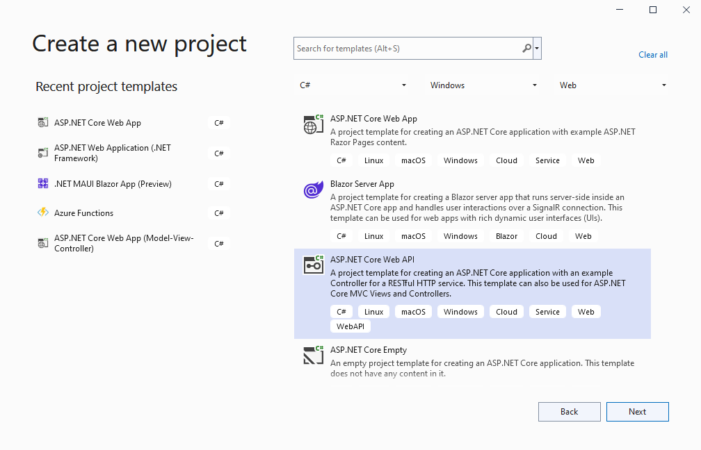
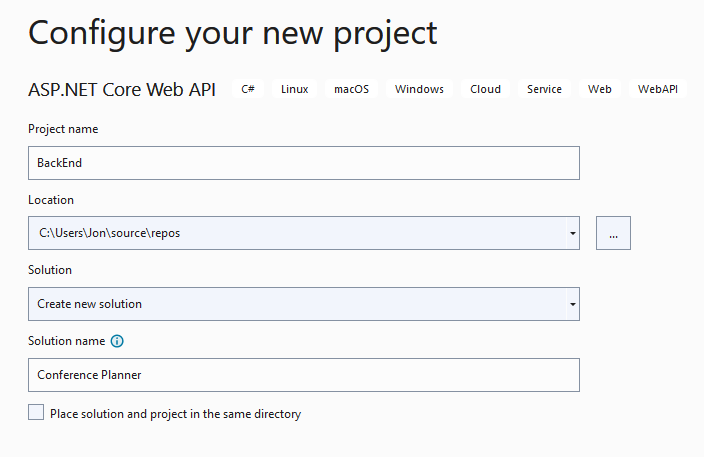
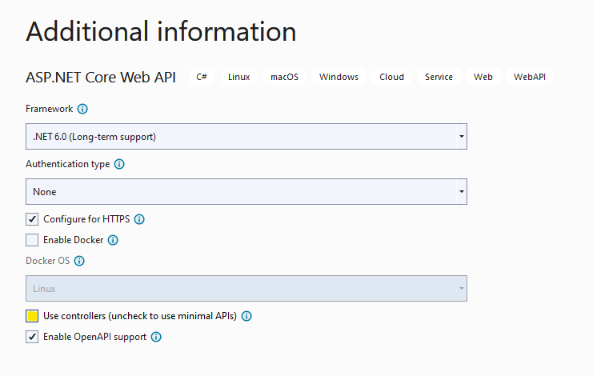
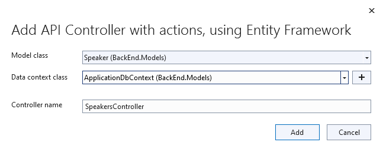
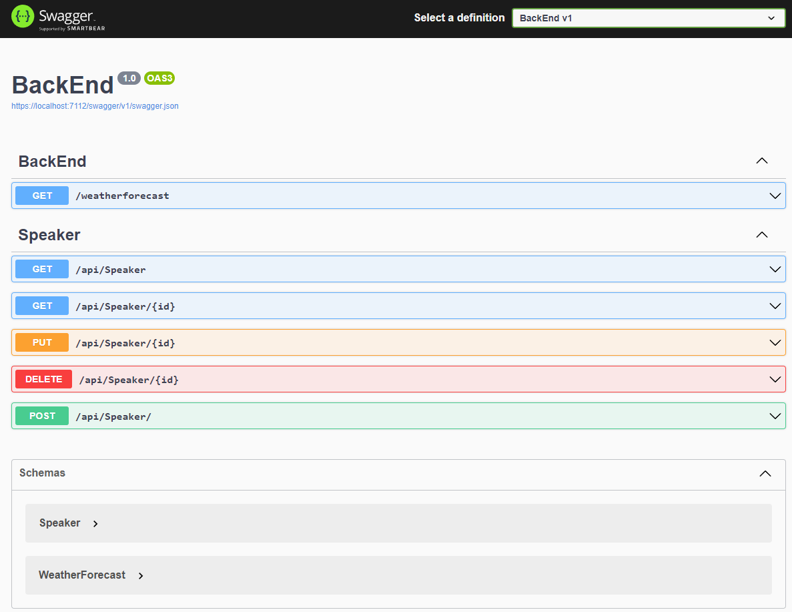
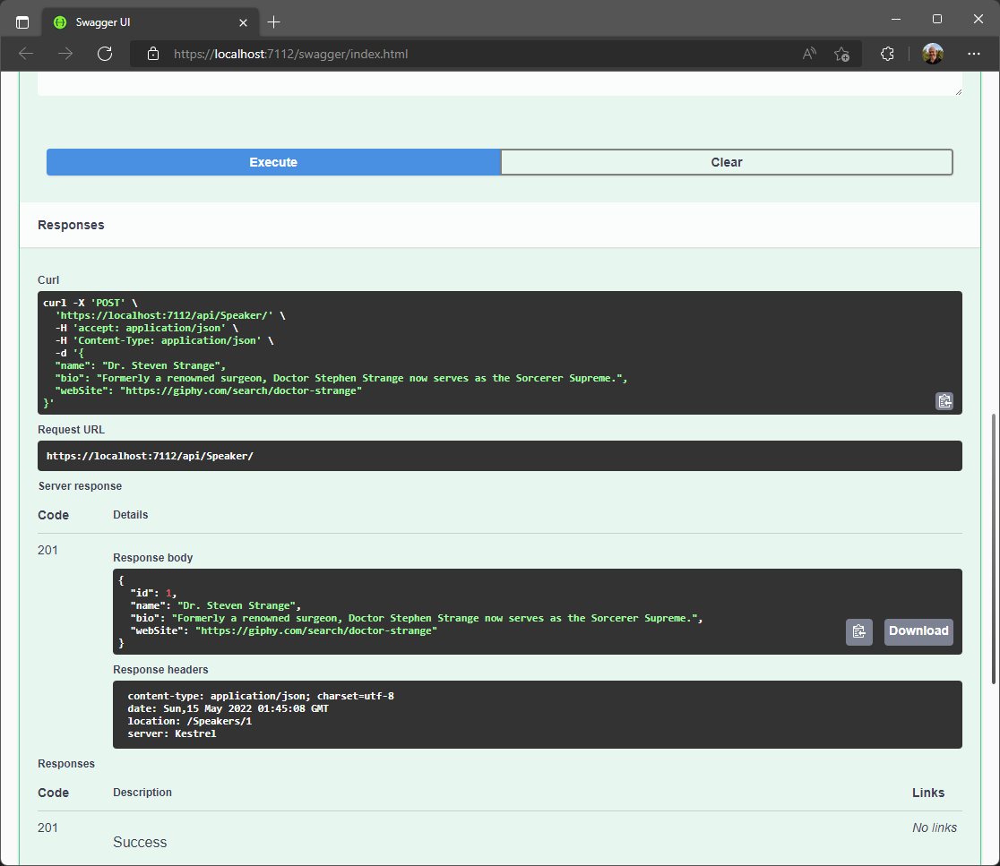

## Creating a new project using Visual Studio

1. Create and add a new project named `BackEnd` and name the solution `ConferencePlanner` using File / New / ASP.NET Core Web API. Select the Web API template, No Auth, no Docker support.

   
   
   

   > ***Note:* If not using Visual Studio, create the project using `dotnet new webapi` at the cmd line, details as follows:**

   > 1. Create folder ConferencePlanner and call `dotnet new sln` at the cmd line to create a solution
   > 2. Create sub-folder BackEnd and create a project using `dotnet new webapi` at the cmd line inside the folder BackEnd
   > 3. Add the project to the solution using `dotnet sln add BackEnd/BackEnd.csproj`

1. Add a new `Models` folder to the root of the application.
1. Add a new `Speaker` class using the following code:

    ```csharp
    using System.ComponentModel.DataAnnotations;
    
    namespace BackEnd.Models;
    
    public class Speaker
    {
        public int Id { get; set; }
    
        [Required]
        [StringLength(200)]
        public string? Name { get; set; }
    
        [StringLength(4000)]
        public string? Bio { get; set; }
    
        [StringLength(1000)]
        public virtual string? WebSite { get; set; }
    }
    ```

1. Add a reference to the NuGet package `Microsoft.EntityFrameworkCore.Sqlite` version `6.0.1`.
    > This can be done from the command line using `dotnet Backend/Backend.csproj add package Microsoft.EntityFrameworkCore.Sqlite --version 6.0.1`
1. Next we'll create a new Entity Framework DbContext. Create a new `ApplicationDbContext` class in the `Models` folder using the following code:

    ```csharp
    using Microsoft.EntityFrameworkCore;
    
    namespace BackEnd.Models
    {
        public class ApplicationDbContext : DbContext
        {
            public ApplicationDbContext(DbContextOptions<ApplicationDbContext> options)
                : base(options)
            {
    
            }

            public DbSet<Speaker> Speakers => Set<Speaker>();
        }
    }
    ```

1. Add a connection string to the *appsettings.json* file for this database:

    ```json
    {
      "ConnectionStrings": {
        "DefaultConnection": "Data Source=ConferencePlanner.db"
      },
      "Logging": {
        "LogLevel": {
          "Default": "Information",
          "Microsoft.AspNetCore": "Warning"
        }
      },
      "AllowedHosts": "*"
    }
    ```

## Register the DB Context Service

1. Add the top of `Program.cs` to read as follows:

    ```csharp
    var builder = WebApplication.CreateBuilder(args);

    // Add services to the container.
    var connectionString = builder.Configuration.GetConnectionString("DefaultConnection") 
       ?? "Data Source=conferences.db";

    builder.Services.AddSqlite<BackEnd.Models.ApplicationDbContext>(connectionString);
    ```

    > This code registers the `ApplicationDbContext` service so it can be injected into controllers. Additionally, it configures Entity Framework to use SQLite with the configured connection string.

## Configuring EF Migrations

You will be using either a terminal window or the Visual Studio Package Manager Console for the following steps.

1. If you are using Visual Studio, open the Package Manager Console by selecting Tools -> NuGet Package Manager -> Package Manager Console and enter `cd BackEnd`.

1. If you are using a terminal window, navigate to the project directory (the directory containing the `Program.cs` file).

1. Install the required NuGet package for migrations:

   ```powershell
   dotnet add package Microsoft.EntityFrameworkCore.Design --version 6.0.1
   ```

1. Install the EntityFramework global tool `dotnet-ef` using the following command:

   ```powershell
   dotnet tool install -g dotnet-ef --version 6.0.1
   ```

1. If you receive a message that the tool is already installed, update to the newest version with the following command:

   ```powershell
   dotnet tool update -g dotnet-ef --version 6.0.1
   ```

1. Run the following commands in the command prompt:

    ```powershell
    dotnet ef migrations add Initial
    dotnet ef database update
    ```

Commands Explained

| Command       |Description       |
| ------------- |-------------|
| `dotnet ef migrations add Initial`     | Generates code to create the initial database schema based on the model specified in 'ApplicationDbContext.cs'. `Initial` is the name of the migration. |  
|`dotnet ef database update` | Creates the database and runs all newly created migrations (in this case, just the `Initial` migration). |

  >For more information on these commands and scaffolding in general, see [this tutorial](https://docs.microsoft.com/aspnet/core/tutorials/first-mvc-app/adding-model#add-initial-migration-and-update-the-database).

  >If your database ever gets in a bad state and you'd like to reset things, you can use `dotnet ef database drop` followed by `dotnet ef database update` to remove your database and run all migrations again.

## A quick look at the Weather Forecast Controller

First, open the `Controllers` folder and take a quick look at the `WeatherForecastController`. You'll see a simple function that corresponds to the HTTP GET verb. You'll see the output of this controller in a bit, but first we'll build our own API controller for the `Speakers` model class.

## Scaffolding an API Controller

### Using Visual Studio

1. Right-click the `Controllers` folder and select Add/Controller. Select "API Controller with actions, using Entity Framework".
1. In the dialog, select the `Speaker` model for the Model Class, `ApplicationDbContext` for the "Data Context Class" and click the `Add` button.
   

### Using the cmd line

1. Install the `aspnet-codegenerator` global tool by running the following command:

    ```powershell
    dotnet tool install -g dotnet-aspnet-codegenerator --version 6.0.1
    ```

1. If you receive a message that the tool is already installed, update to the newest version with the following command:

   ```powershell
   dotnet tool update -g dotnet-aspnet-codegenerator --version 6.0.1
   ```

> Note: You will need to close and reopen the console window to be able to use this tool.

1. Run the following in the project folder at the cmd line:

    ```powershell
    dotnet aspnet-codegenerator controller -api -name SpeakersController -m Speaker -dc BackEnd.Models.ApplicationDbContext -outDir Controllers
    ```

## Testing the API using the Swashbuckle

In this section, we'll be adding documentation to our API using the Swashbuckle NuGet package.

[Swashbuckle.AspNetCore](https://github.com/domaindrivendev/swashbuckle.aspnetcore) is an open source project for generating Swagger documents for Web APIs that are built with ASP.NET Core. This package is included by default in ASP.NET Core Web API project in .NET 6.0.

[Swagger](https://swagger.io) is a machine readable representation of a RESTful API that enables support for interactive documentation, client SDK generation and discoverability.

Additional information on using Swashbuckle in ASP.NET Core is available in this tutorial: [ASP.NET Web API Help Pages using Swagger](https://docs.microsoft.com/aspnet/core/tutorials/web-api-help-pages-using-swagger)

1. Run the application (F5 in Visual Studio or `dotnet run` from console).
1. If the browser does not automatically open, browse to the Swagger UI at `http://localhost:<random_port>/swagger`.
    
1. First, click on the *GET* button in *WeatherForecast* section. You'll see the values that were listed in the `WeatherForecastController` earlier.
1. In the *Speakers* section, click on the *GET* button. You'll see there are no speakers returned. Let's add one!
1. In the *Speakers* section, click on the *POST* button. Referencing the example on the right, fill in a speaker request. Leave the `ID` blank, that will be filled in by the database.

    

    ```json
    {
      "name": "Tyrion Lannister",
      "bio": "Drinks and knows things",
      "webSite": "http://giphy.com/search/tyrion-lannister"
    }
    ```

1. When you click the *Execute* button, you should see a success response from the server. Now, trying out the *GET* endpoint above should show your newly added speaker.

    

**Next**: [Session #2 - Back-end](2.%20Build%20out%20BackEnd%20and%20Refactor.md)
